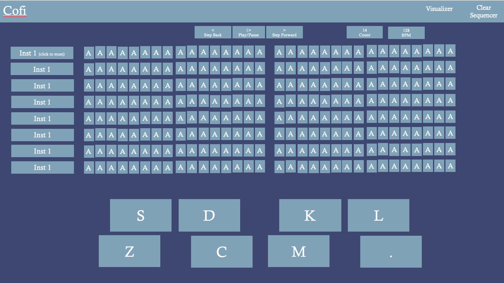
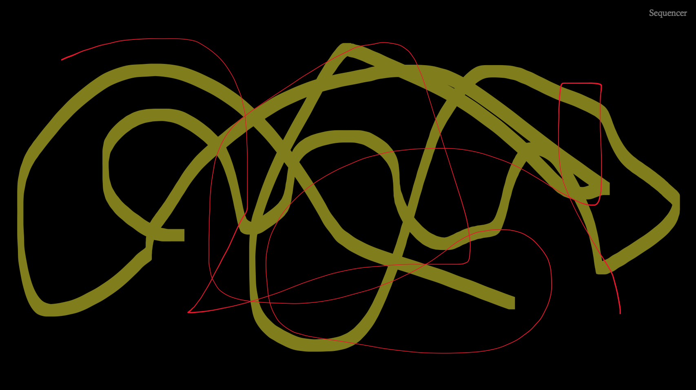
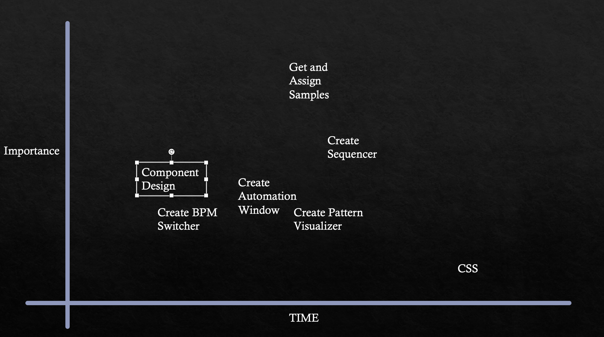
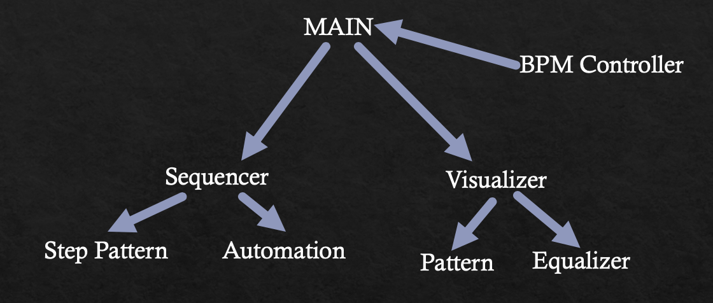

# Audiovisual-Step-Sequencer

This project is an audio (and visual) experience allowing the user to create rhythms and visual patterns with various instruments.

DESCRIPTION

A keyboard-controlled step sequencer that loads sounds from the internet and allows users to create and save a simple rhythms. Users can control several parameters including: tempo, instrument mute (toggle), instrument activation, volume automation.

This project uses react to control several components within the page. This is a pseudo-multipage application, using React Router to link the user to different instrument modification like automation. Switching between pages while preserving track and instrument state requires some form of local storage to be used. The second page is for visualizations. The third page is a link to a component that clears the current board. the fourth link is a link to a song saving link

MVP

- Website with aesthetic formatting
- Loads a sample pack from BandCamp/SoundCloud and assigns/maps sounds to keys
- Sequencer
- Toggle mute for instruments (click to toggle individual instruments, keypress to toggle all on/off mute, keypress to toggle all opposite values)
- Change BPM
- Routes to automation, sequencer, pattern visualizer, EQ visualizer

PMVP

- Paint splatter visual setting (still image, alternative to the transient visual)
- Save MIDI to hard drive
- Multiple sample packs
- Instrument(s) with notes
- Use microphone to create samples
- Automation window
    - Cutoff
    - Resonance
    - Pitch

TIMELINE

| Component                   | Priority | Estimated Time | Time Invested | Time ∆   |
| :-------------------------: | :------: | :------------: | :-----------: | :------: |
| CSS Structuring             |    L     |        400 Min |         0 min |   +0 min |
| Component Design            |    H     |        120 Min |        30 min |   +0 min |
| Get & Assign Samples Algo   |    H     |        300 Min |         0 min |   +0 min |
| Create Sequencer            |    H     |        240 Min |         0 min |   +0 min |
| Create BPM controller       |    M     |        100 Min |       120 min |  +20 min |
| Create Pattern Visualizer   |    M     |        180 Min |         0 min |   +0 min |
| Create Automation Window    |    H     |        200 Min |         0 min |   +0 min |
|            TOTAL            |   N/A    |       1440 Min |       120 min |  +20 min |

WIREFRAME

Sequencer (Main)

Visualizer

PRIORITY MATRIX

COMPONENT FLOW

API SAMPLE

https://bandcamp.com/stat_record?kind=track%20play&track_id=1846085353&track_license_id&from=album%20page&from_url=https%3A%2F%2Fmillymusicgroup.bandcamp.com%2Falbum%2Ftalking-secret-single&phase=started&reference_num=134771774&band_id=3991463843&rand=4302376839957358

REACT COMPONENT HIERARCHY

- Sequencer
    - MIDI (instrument timings)
    - Automation
- Visualizer
    - EQ Visualizer
    - Pattern Visualizer
- BPM Switcher

FUNCTIONAL COMPONENTS

0) Main
    Area where user can navigate between sequencer and visualizer (and saved rhythms when functionality is built)
1) Sequencer
    This displays the sequencer panel and allows the user to switch between
1a) MIDI (instrument timings)
    This displays the timings of all instrument activations. When the sequencer passes over an activated timing, it will play that sound. The user can click to activate/deactivate any of these steps in the sequence. Multiple instruments can play simultaneously.
1b) Automation
    Allows user to control parameters specific to each timing- activation, pitch, cutoff, and other sonic properties.

2) Visualizer
2a) EQ Visualizer
2b) Pattern Visualizer

3) BPM Switcher

CODE SNIPPET

ISSUES AND RESOLUTIONS